# Civic Services Surveillance & Monitoring

On-device detection of **16 street-level civic conditions** from a phone camera or
vehicle-mounted footage — garbage, potholes, encroachments, billboards, manhole state,
streetlight state, and stray animals. A single YOLO11n model runs fully offline on an
Android phone; every confirmed issue is saved locally as a cropped photo plus a JSON
incident report.

| | |
|---|---|
| **Model** | YOLO11n (Ultralytics), 5.3 MB `.pt` / 3.0 MB INT8 TFLite |
| **Classes** | 16 |
| **Dataset** | 3,896 images · 6,581 boxes · 80/10/10 stratified, leakage-free |
| **Test mAP@50** | **0.604** |
| **Field accuracy** | 66% over 201 human-judged photos |
| **Deployment** | Android (CameraX + TFLite), offline |

---

## Classes

| | | | |
|:--:|:--:|:--:|:--:|
| 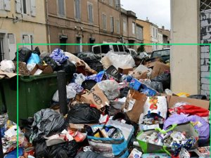<br>**garbage_pile** | 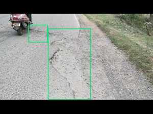<br>**pothole** | 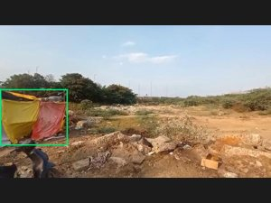<br>**encroachment** | 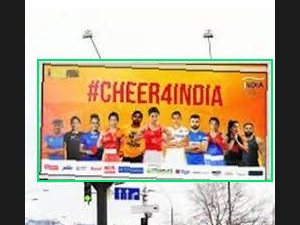<br>**billboard_hoarding** |
| 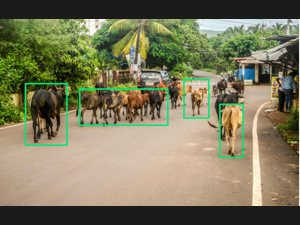<br>**cow** | 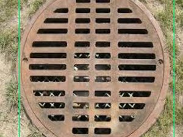<br>**manhole_closed** | 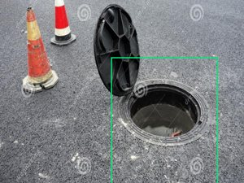<br>**manhole_open** | 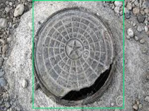<br>**manhole_broken** |
| 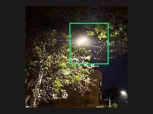<br>**streetlight_working** | 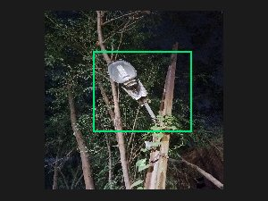<br>**streetlight_not_working** | 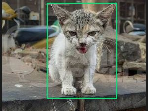<br>**cat** | 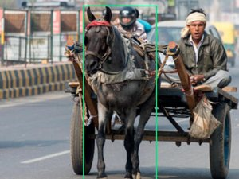<br>**horse** |
| 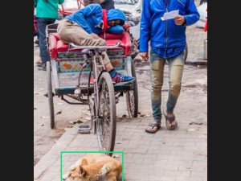<br>**dog** | 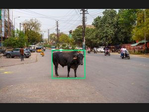<br>**buffalo** | 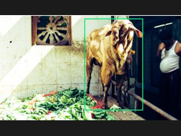<br>**goat** | 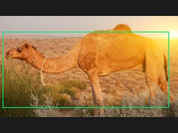<br>**camel** |

`manhole_closed` and `streetlight_working` are **healthy states** — detected on purpose,
then deliberately *not* reported. A working streetlight is not a civic incident.

### Class distribution

| class | train | val | test | | class | train | val | test |
|---|---:|---:|---:|---|---|---:|---:|---:|
| garbage_pile | 499 | 62 | 62 | | streetlight_working | 328 | 42 | 42 |
| pothole | 568 | 71 | 71 | | streetlight_not_working | 168 | 21 | 21 |
| encroachment | 378 | 47 | 47 | | cat | 34 | 4 | 4 |
| billboard_hoarding | 388 | 48 | 48 | | horse | 48 | 6 | 6 |
| cow | 74 | 9 | 9 | | dog | 47 | 6 | 6 |
| manhole_closed | 18 | 2 | 2 | | buffalo | 25 | 3 | 3 |
| manhole_open | 325 | 40 | 40 | | goat | 29 | 4 | 4 |
| manhole_broken | 139 | 17 | 17 | | camel | 52 | 7 | 7 |

---

## Results

Four class-balancing strategies trained under identical hyperparameters, evaluated on
the same held-out 389-image test split (verified byte-identical by content fingerprint).

| method | train images | mAP@50 | mAP@50-95 |
|---|---:|---:|---:|
| **oversampled (Repeat Factor Sampling)** | 3,797 | **0.604** | **0.364** |
| unbalanced (baseline) | 3,118 | 0.596 | 0.343 |
| augmented | 3,797 | 0.568 | 0.344 |
| undersampled | 1,640 | 0.532 | 0.299 |

Oversampling with RFS (`r_c = max(1, √(t/f_c))`, t=0.1) wins — rare classes repeat
1.4–4.2×, common classes are untouched.

### Field testing

201 photos judged by human testers through the built-in review dashboard:

| verdict | share |
|---|---:|
| correct | **66%** |
| partially right | 2% |
| wrong class | 9% |
| **nothing detected** | **22%** |

When the model does fire it is usually right — 91% on `manhole_open`, 88% on
`garbage_pile`. **The dominant failure is silence, not misnaming**, which is a recall
problem rather than a precision one.

---

## Quick start

```bash
git clone https://github.com/PrinceVerma04/Object-detection-in-Autonomous-vehicle.git
cd Object-detection-in-Autonomous-vehicle
python -m venv .venv && source .venv/bin/activate
pip install -r requirements.txt
```

Run the detector on an image:

```python
from ultralytics import YOLO
model = YOLO("models/civic_16class_yolo11n.pt")
model.predict("street.jpg", conf=0.25, save=True)
```

### Interactive dashboards

```bash
./run_dashboard.sh                  # Streamlit demo — images / folder / video   :8501
python model_test_dashboard.py      # multi-person testing + annotation          :5080
```

Both bind `0.0.0.0`, so anyone on the same WiFi can use them. The test dashboard stores
each person's photos and hand-drawn corrections under their own name and aggregates
live accuracy at `/stats`.

> **Note:** neither dashboard has authentication. Fine on a LAN; add auth before
> exposing either to the internet.

---

## Training

```bash
python data/build_train_variants.py                      # build the 3 balanced variants
python train_compare.py --method all --epochs 100        # train all four, sequentially
python compare_results.py                                # side-by-side comparison
```

Export for mobile:

```bash
python export.py --weights models/civic_16class_yolo11n.pt
```

---

## Data pipeline

The dataset itself is **not** in this repo (4.2 GB). Full provenance for every source —
licence, origin, and why it was kept or rejected — is in `docs/DATASET_UPDATE_LOG.md`.

| script | purpose |
|---|---|
| `scripts/audit_dataset.py` | 14-check integrity audit (leakage, duplicates, degenerate boxes, split coverage) |
| `data/restratify_splits.py` | leakage-safe stratified splitter using perceptual hashing |
| `data/build_train_variants.py` | builds oversampled / undersampled / augmented variants |
| `data/remap_class_ids.py` | one-time contiguous class-id renumbering |
| `scripts/snapshot_dataset.py` | freezes a dataset record before every training run |
| `review_audit_flags_dashboard.py` | web UI for reviewing and correcting flagged annotations |

### Why perceptual hashing matters here

An exact-hash duplicate check reported a clean dataset while **25% of the test set had a
near-identical twin in training** — consecutive video frames, re-uploads under different
filenames, and the same stock photo arriving via two source datasets. None were
byte-identical. The splitter now groups images by dHash (Hamming ≤ 6) and keeps each
group entirely within one split. Verified: 1,045 leaking pairs → 0.

---

## Android app

`android_app/` — Kotlin, CameraX + TFLite, fully offline.

```bash
export JAVA_HOME=/path/to/jdk
cd android_app && ./gradlew assembleDebug
adb install -r app/build/outputs/apk/debug/app-debug.apk
```

The detector letterboxes frames to square before inference, matching how the model was
trained. Stretching to square instead — which the app originally did — distorts every
object and cost ~9 points of accuracy on real photos.

---

## Known limitations

- **`manhole_closed` is often predicted as `manhole_broken`** at ~0.9 confidence. With
  only 18 training images this class is undertrained, and in the app it can file false
  incident reports.
- **`dog` collapses into `cow`** on out-of-distribution photos. 47 training images is not
  enough to separate them.
- **39% of `billboard_hoarding` training images are 360°/panoramic captures**, so the
  class performs poorly on ordinary flat photos.
- **Camera tilt beyond ~15°** degrades accuracy sharply (measured: −15% at 15°, −60% at 30°).
- Four classes have too few val/test images to score reliably: `manhole_closed` (2),
  `buffalo` (3), `goat` (4), `cat` (4).

These are data-collection gaps, not tuning problems — a retrain with heavier geometry
augmentation was tried and made results *worse* (0.590 vs 0.604).

---

## Licence

Code released under the MIT Licence. Dataset images are **not** redistributed here;
see `docs/DATASET_UPDATE_LOG.md` for per-source licences and attribution.
